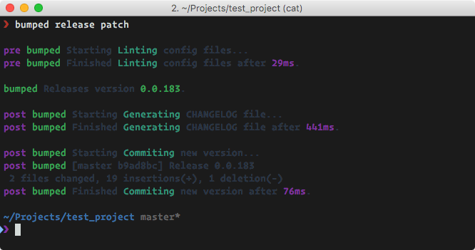

# bumped-terminal

<h1 align="center">
  <br>
  
  <br>
  <br>
</h1>


[](https://david-dm.org/bumped/bumped-terminal)
[](https://david-dm.org/bumped/bumped-terminal#info=devDependencies)
[](https://www.npmjs.org/package/bumped-terminal)
[](https://paypal.me/kikobeats)

> Executes whatever terminal command inside bumped as `prerelease` or `postrelease` action.

## Install

You don't need to install it! Bumped automatically resolve the plugins dependencies. However if you still want to do so must be globally accessible:

```bash
$ npm install -g bumped-terminal
```

## Configuration

Configure your `.bumpedrc` adding a entry for `bumped-terminal` as the follow example:

```cson
files: [
  "package.json"
  "bower.json"
]

plugins:
  postrelease:
    'Task description':
      plugin: 'bumped-terminal'
      command: 'your command'
      # options: it will passed to child_process.spawn, see docs
```

The plugin provide you a serie of keywords for use in your commands as well:

* **$newVersion**: Alias for `bumped._version` (the current semver version).
* **$oldVersion**: Alias for `bumped._oldVersion` (the before semver version).

Additionally you can provide [child_process.spawn#options](https://nodejs.org/api/child_process.html#child_process_child_process_spawn_command_args_options)

## Example

```cson
files: [
  'package.json'
]

plugins:

  prerelease:
    'Linting config files':
      plugin: 'bumped-finepack'

  postrelease:

    'Generating CHANGELOG file':
      plugin: 'bumped-changelog'

    'Commiting new version':
      plugin: 'bumped-terminal'
      command: 'git add CHANGELOG.md package.json && git commit -m "Release $newVersion"'
```

which produces the following output:

<p align="center"></p>

## License

MIT © Bumped
